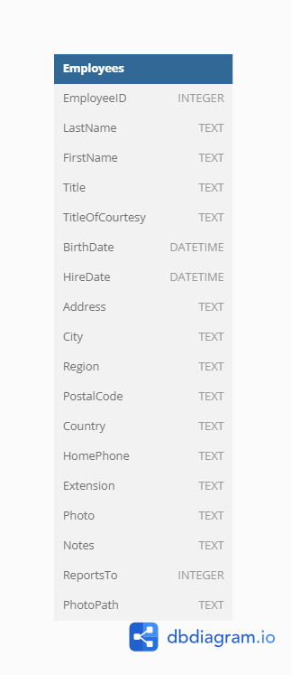

# Northwind Employee Service (ADO.NET)

The intermediate-level task is for practicing [ADO.NET](https://learn.microsoft.com/en-us/dotnet/framework/data/adonet/), involving connection to the database, retrieving data from, and performing data manipulations stored in the [SQLite](https://www.sqlite.org/index.html) database.

Estimated time to complete the task - 3h.

The task requires [.NET 6 SDK](https://dotnet.microsoft.com/en-us/download/dotnet/6.0) to be installed.

## Task Description

Implement the `EmployeeAdoNetService` class to interacts with the Employees table data of the Northwind database  using [ADO.NET](https://learn.microsoft.com/en-us/dotnet/framework/data/adonet/). You will need to write the methods for retrieving, adding, updating, and removing employee records stored in the [SQLite in-memory database](https://learn.microsoft.com/en-us/dotnet/standard/data/sqlite/in-memory-databases):

Before starting the task
- study the table of the `Northwind` database diagram

- learn [Microsoft.Data.Sqlite](https://learn.microsoft.com/en-us/dotnet/standard/data/sqlite/?tabs=netcore-cli) ADO.NET provider for SQLite.

Then follow the instructions below to complete the task:

- Implement the `GetEmployees` method to retrieve a list of all employees from the `Employees` table.
- Implement the `GetEmployee` method to retrieve the employee data with the specified `ID` from the `Employees` table. Create an `Employee` object from the retrieved data and return it. If the employee is not found, throw an exception with the message "Employee not found.". 
- Implement the `AddEmployee` method to add a new employee record to the `Employees` table using the provided data. Method must return the ID of the newly added employee and if the insertion fails, throw an exception with the message "Inserting an employee failed."
- Implement the `RemoveEmployee` method to remove the employee with the specified ID from the `Employees` table.
- Implement the `UpdateEmployee` method to update the employee's information in the `Employees` table using the provided data. If the update fails, throw an exception with the message "Employees is not updated."

_Task details is given in the XML comments for each method._

An employee is represented by the [Employee](/NorthwindEmployeeAdoNetService/Employee.cs) class. 

## See also

- [SQLite documentation](https://www.sqlite.org/lang.html)
- Microsoft.Data.Sqlite
    - [Microsoft.Data.Sqlite overview](https://learn.microsoft.com/en-us/dotnet/standard/data/sqlite/)
    - [Connection strings](https://learn.microsoft.com/en-us/dotnet/standard/data/sqlite/connection-strings)
    - [Data types](https://learn.microsoft.com/en-us/dotnet/standard/data/sqlite/types)
    - [Parameters](https://learn.microsoft.com/en-us/dotnet/standard/data/sqlite/parameters)
    - [Metadata (Sqlite)](https://learn.microsoft.com/en-us/dotnet/standard/data/sqlite/metadata)
