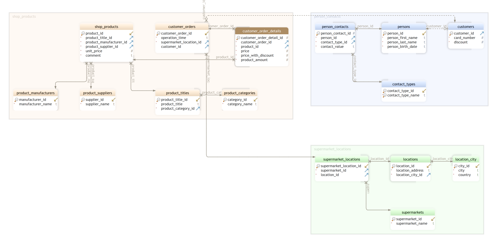

# Shop Database (Entity Framework Core)

Intermediate level task for practicing Entity Framework model configuration and LINQ-to-SQL queries.

Estimated time to complete the task - 1.5h.

The task requires .NET 6 SDK installed.

## Task Description

This task is based on the *Store* database. The database structure is show on the diagram below:

Analyze and study the database diagram before starting the task.

### 1. Data Annotations

Configure the [Entity Framework models](https://learn.microsoft.com/en-us/ef/core/#the-model) for the *Shop* database using the [data annotations](https://learn.microsoft.com/en-us/ef/core/modeling/#use-data-annotations-to-configure-a-model). The models are the classes in the [Models](ShopReports/Models) folder.

* Apply the [TableAttribute](https://learn.microsoft.com/en-us/dotnet/api/system.componentmodel.dataannotations.schema.tableattribute) to all models to specify the database table that a model is mapped to.
* Apply the [ColumnAttribute](https://learn.microsoft.com/en-us/dotnet/api/system.componentmodel.dataannotations.schema.columnattribute) to a model properties to specify a database column that a model property is mapped to.
* Apply the [KeyAttribute](https://learn.microsoft.com/en-us/dotnet/api/system.componentmodel.dataannotations.keyattribute) to a model property that uniquely identifies an entity.
* Apply the [ForeignKeyAttribute](https://learn.microsoft.com/en-us/dotnet/api/system.componentmodel.dataannotations.schema.foreignkeyattribute) to a model property that is used as a foreign key in a relationship.

### 2. Shop Reports

In this section you have to implement few service methods that generate various reports.

#### 2.1. Product Category Report

Implement the [GetProductCategoryReport](ShopReports/Services/ProductReportService.cs#L16) method of the *ProductReportService* class:
* The method must return an instance of the [ProductCategoryReport](ShopReports/Reports/ProductCategoryReport.cs) class.
* A report must contain all product categories sorted by a category name.
* Each report line must have a product category identifier and a product category name.

#### 2.2. Product Report

Implement the [GetProductReport](ShopReports/Services/ProductReportService.cs#L22) method of the *ProductReportService* class:
* The method must return an instance of the [ProductReport](ShopReports/Reports/ProductReport.cs) class.
* A report must contain all products sorted by a product title (descending).
* Each report line must have a product title identifier, product title, manufacturer name and unit price.

#### 2.3. Full Product Report

Implement the [GetFullProductReport](ShopReports/Services/ProductReportService.cs#L28) method of the *ProductReportService* class:
* The method must return an instance of the [FullProductReport](ShopReports/Reports/FullProductReport.cs) class.
* A report must contain all products sorted by a product title.
* Each report line must have a product title identifier, product title, product category identifier, manufacturer name, unit price and a product category name.

#### 2.4. Product Sales Revenue Report

Implement the [GetProductTitleSalesRevenueReport](ShopReports/Services/ProductReportService.cs#L34) method of the *ProductReportService* class:
* The method must return an instance of the [ProductTitleSalesRevenueReport](ShopReports/Reports/ProductTitleSalesRevenueReport.cs) class.
* A report must contain all product titles sorted by a sum of price with discount  (descending).
* Each report line must have a product title name, sum of price with discount and sum of product amount.

#### 2.5. Customer Sales Revenue Report

Implement the [GetCustomerSalesRevenueReport](ShopReports/Services/CustomerReportService.cs#L16) method of the *CustomerReportService* class:
* The method must return an instance of the [CustomerSalesRevenueReport](ShopReports/Reports/CustomerSalesRevenueReport.cs) class.
* Each report line must have a customer identifier, person first name, person last name and sum of price with discount.
* Report lines must be sorted by a sum of price with discount (descending).
